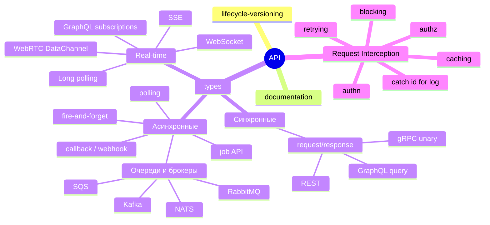
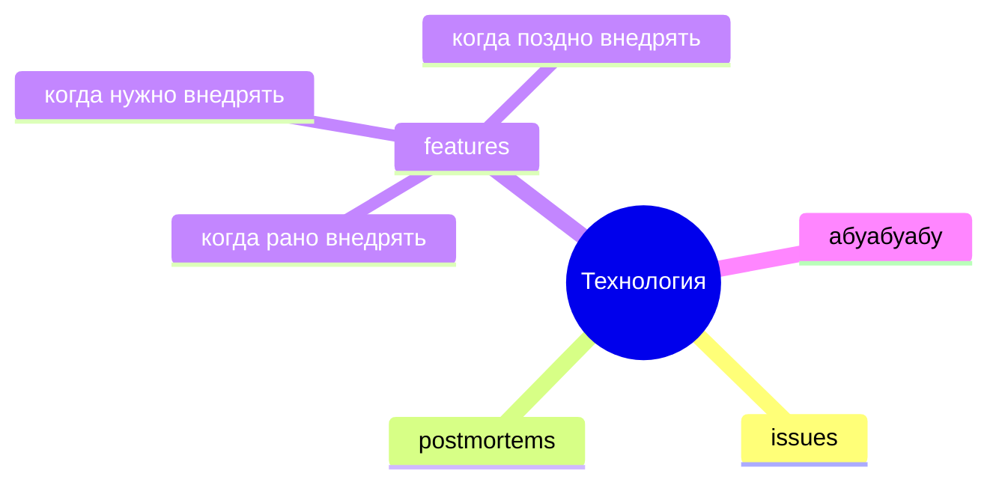
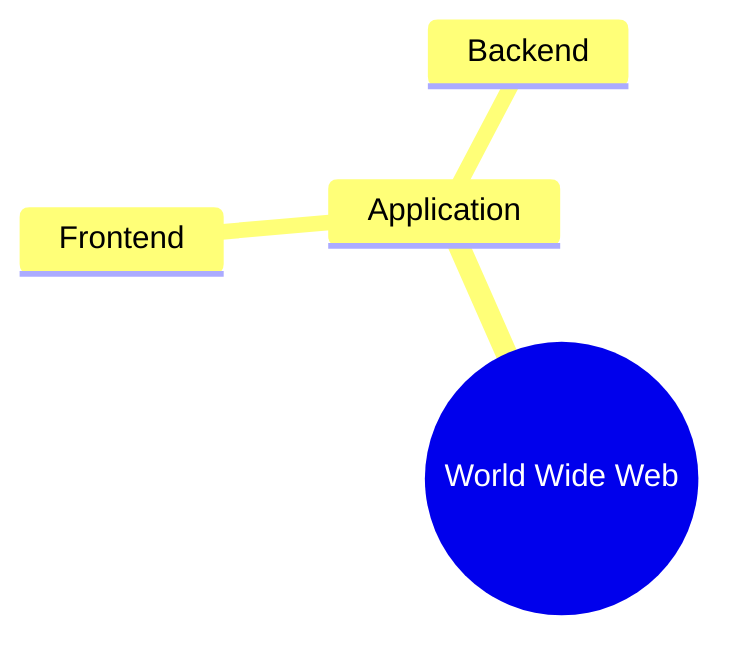
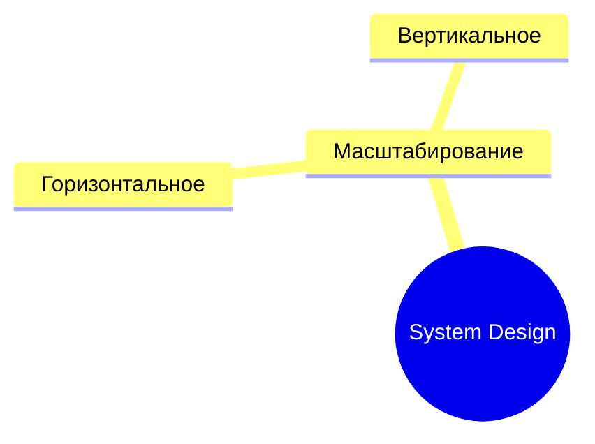
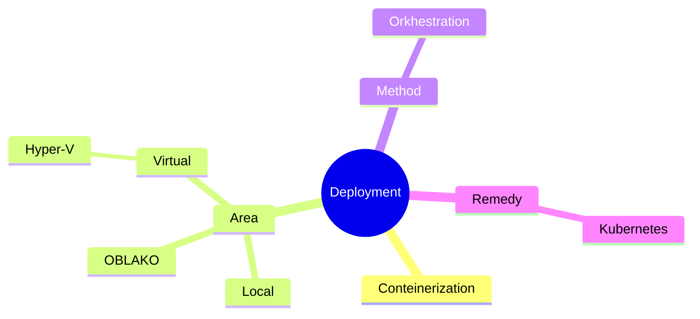
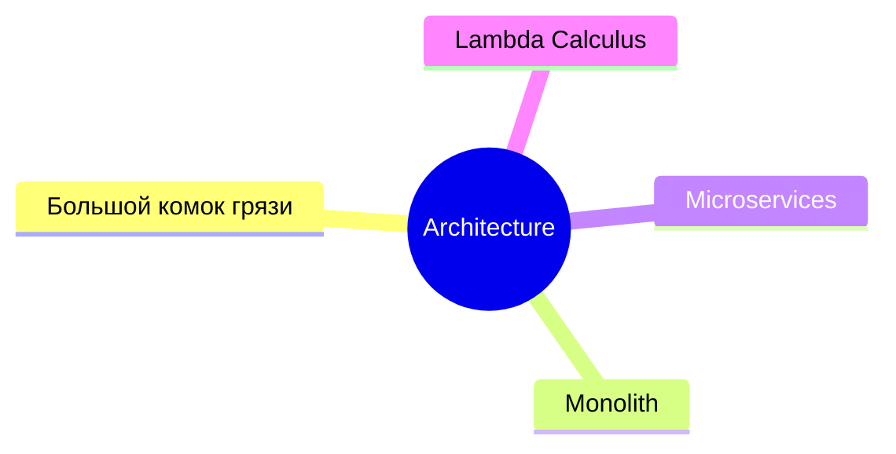

API

interception realizations
- sidecar 
- in app

check rfc 7807
vulneabilities

documentation tools
- readme.com ??

--------------
sdie carr 
data plain
control playn
__________
argo
automation
- ansimble
- trerraform
________
cloud aws
Route53 SES EC2 VPC S3
_____
sending 
	files
	streams
	jsons
	*****ui*****  как отдается ui?
____

- Network
	- Стеки протоколов
		- OSI
		- TCP/IP
		- L1 Application
	- API
		- Realizations
- Protocols
- API
- 
- HTTP
- JavaScript
- TypeScript
- NodeJS
- NestJS
- Databases
	- Data Storage
	- Cache Storage
	- Message Broker
- PostgreSQL
- Redis
- RabbitMQ
- NATS

