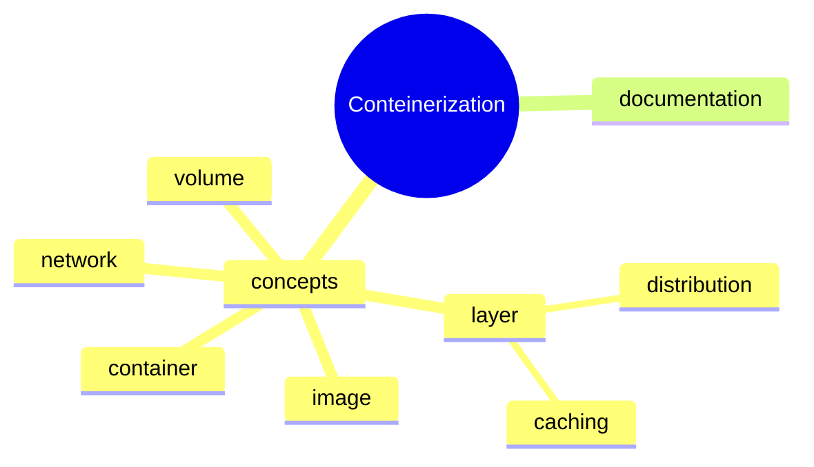
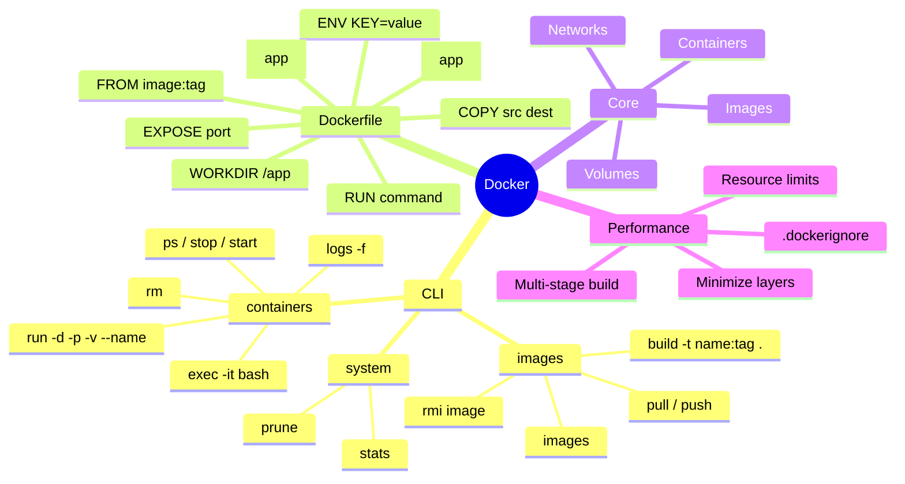

API

```mermaid
mindmap
	root((Conteinerization))
		concepts
			volume
			container
				
			image
			layer
				caching
				distribution
			network
		documentation
```

```mermaid
mindmap
  root((Docker))
    CLI
      images
        build -t name:tag .
        images
        rmi image
        pull / push
      containers
        run -d -p -v --name
        ps / stop / start
        exec -it bash
        logs -f
        rm
      system
        prune
        stats
    Dockerfile
      FROM image:tag
      WORKDIR /app
      RUN command
      COPY src dest
      ENV KEY=value
      EXPOSE port
      CMD ["app"]
      ENTRYPOINT ["app"]
    Core
      Images
      Containers
      Volumes
      Networks
    Performance
      Multi-stage build
      Minimize layers
      .dockerignore
      Resource limits
```

